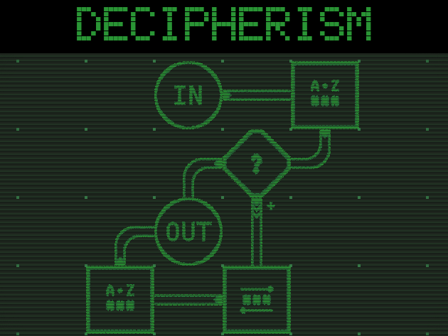

## Overview

A puzzle game where you solve the encoding machine ciphers.

The key features are:

* Puzzles that can be solved in more than one way
* Complex cross-level secrets
* A stylish in-game manual
* Immersive interface

This game natively works on Windows, Linux and in browsers (wasm build). You can download the native binary or play it in browser at [itch.io](https://quasilyte.itch.io/decipherism).

## Game Development Details

This game is a [Game Off 2022](https://itch.io/jam/game-off-2022) game jam submission.

The game jam theme is **cliche**. Therefore, you're hacking a ~~Penth~~ Hexagon
using some retro-style hacking device with bright green consoles.

The game created using [Ebitengine](https://github.com/hajimehoshi/ebiten/).
It's proper home is [quasilyte/ge](https://github.com/quasilyte/ge/) repository,
but since it's a requirement to create a separate per-game repository, here we are.

## Lincense and Credits

Everything is licensed under the MIT license, unless there is an entry in CREDITS for that asset.
If there is an entry in CREDITS file, it overrides the default MIT licensing.

The game itself doesn't have a credits screen, but all places where you can download this
game should include a supplementary CREDITS file.
