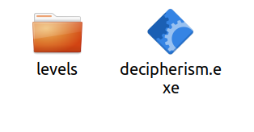
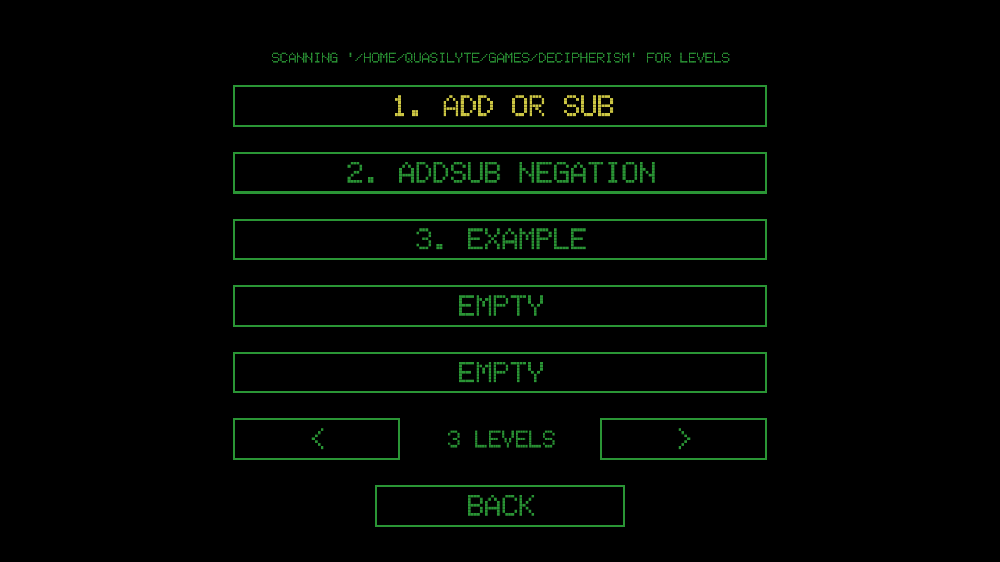

# Running Custom Levels

To run a custom level, you first need to either [create it](creating_custom_levels.md) or download it.

Let's suppose that you have a level file named `example.json` (level files are always a single JSON file).

The easiest way to make the game locate that file is to put it next to the game, like so:

```
* decipherism.exe
* levels/
    * example.json
```



So, you first create a "levels" folder next to the executable and then you put all custom levels in there.

If you don't want to store the levels next to the game executable, you can set the `$DECIPHERISM_DATA` environment variable. It should point to the directory containing the `levels/` folder.

To run a custom level, click "Run a custom simulation" main menu button. You'll see a screen listing the custom levels found by the game.



Click a level from that list to run it.
